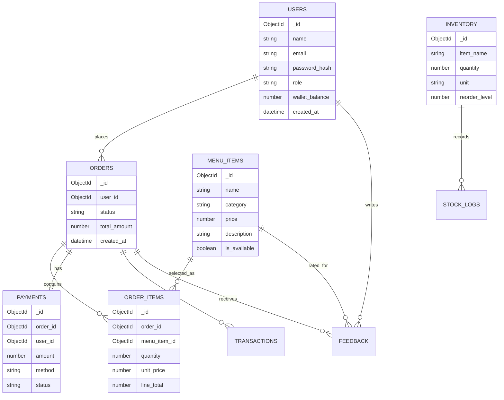

# ER Diagram / MongoDB Reference Diagram

Paste this Mermaid code into https://mermaid.live or any Mermaid-supported markdown viewer.

```mermaid
erDiagram
    USERS ||--o{ ORDERS : places
    ORDERS ||--o{ ORDER_ITEMS : contains
    MENU_ITEMS ||--o{ ORDER_ITEMS : selected_as
    ORDERS ||--|| PAYMENTS : has
    ORDERS ||--o{ TRANSACTIONS : logs
    INVENTORY ||--o{ STOCK_LOGS : records
    USERS ||--o{ FEEDBACK : writes
    ORDERS ||--o{ FEEDBACK : receives
    MENU_ITEMS ||--o{ FEEDBACK : rated_for

    USERS {
      ObjectId _id
      string name
      string email
      string password_hash
      string role
      number wallet_balance
      datetime created_at
    }
    MENU_ITEMS {
      ObjectId _id
      string name
      string category
      number price
      string description
      boolean is_available
    }
    ORDERS {
      ObjectId _id
      ObjectId user_id
      string status
      number total_amount
      datetime created_at
    }
    ORDER_ITEMS {
      ObjectId _id
      ObjectId order_id
      ObjectId menu_item_id
      number quantity
      number unit_price
      number line_total
    }
    PAYMENTS {
      ObjectId _id
      ObjectId order_id
      ObjectId user_id
      number amount
      string method
      string status
    }
    INVENTORY {
      ObjectId _id
      string item_name
      number quantity
      string unit
      number reorder_level
    }
```
